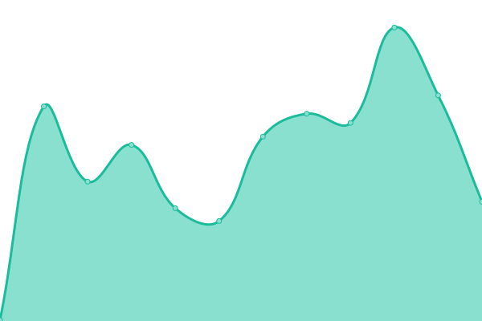

# Streamliners System Status Monitor

This repository contains the open-source uptime monitor and status page for [Streamliners NZ Ltd](https://www.streamliners.com/), powered by [Upptime](https://github.com/upptime/upptime).

With [Upptime](https://upptime.js.org), you can get your own unlimited and free uptime monitor and status page, powered entirely by a GitHub repository. We use [Issues](https://github.com/StreamlinersNZ/UptimeMonitor/issues) as incident reports, [Actions](https://github.com/StreamlinersNZ/UptimeMonitor/actions) as uptime monitors, and [Pages](https://StreamlinersNZ.github.io/UptimeMonitor) for the status page.

## 📈 Live Status<!--live status--> **🟩 All systems operational**

<!--start: status pages-->
<!-- This summary is generated by Upptime (https://github.com/upptime/upptime) -->
<!-- Do not edit this manually, your changes will be overwritten -->
<!-- prettier-ignore -->
| URL | Status | History | Response Time | Uptime |
| --- | ------ | ------- | ------------- | ------ |
|  [Streamliners](https://www.streamliners.com/) | 🟩 Up | [streamliners.yml](https://github.com/StreamlinersNZ/UptimeMonitor/commits/HEAD/history/streamliners.yml) | 

 253ms
     
 | 

<a href="https://StreamlinersNZ.github.io/UptimeMonitor/history/streamliners">100.00%</a>
    

|  [HealthPathways Hub](https://hub.healthpathwayscommunity.org/) | 🟩 Up | [health-pathways-hub.yml](https://github.com/StreamlinersNZ/UptimeMonitor/commits/HEAD/history/health-pathways-hub.yml) | 

 464ms
     
 | 

<a href="https://StreamlinersNZ.github.io/UptimeMonitor/history/health-pathways-hub">99.73%</a>
    

|  [Dot](https://admin.healthpathwayscommunity.org/) | 🟩 Up | [dot.yml](https://github.com/StreamlinersNZ/UptimeMonitor/commits/HEAD/history/dot.yml) | 

 915ms
     
 | 

<a href="https://StreamlinersNZ.github.io/UptimeMonitor/history/dot">100.00%</a>
    

<!--end: status pages-->

[**Visit our status website →**](https://StreamlinersNZ.github.io/UptimeMonitor)

## 📄 License

- Powered by: [Upptime](https://github.com/upptime/upptime)
- Code: [MIT](./LICENSE) © 2025 Streamliners Ltd
- Built with [Upptime](https://upptime.js.org) - MIT © [Anand Chowdhary](https://anandchowdhary.com)
- Data in the `./history` directory: [Open Database License](https://opendatacommons.org/licenses/odbl/1-0/)

## 🔗 Links

- [Streamliners Website](https://www.streamliners.com/)
- [Upptime Documentation](https://upptime.js.org/docs)
